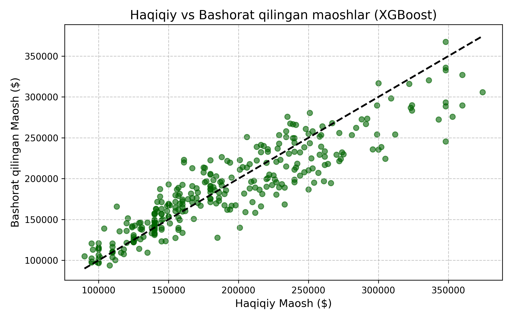
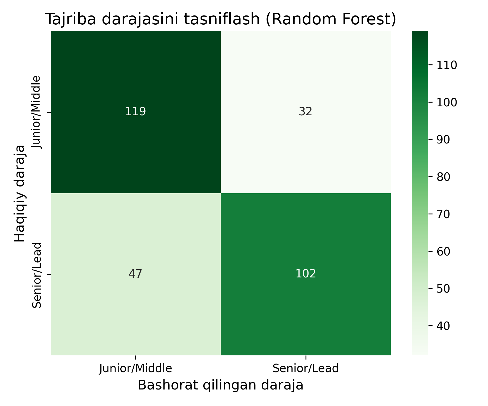

# 📊 Tech Job Salary & Experience Predictor (2025-2026)


Ushbu loyihada AI mehnat bozoridagi mutaxassislar maoshini va ularning tajriba darajasini aniqlovchi **Kaskadli Machine Learning (Cascaded ML Pipeline)** arxitekturasi ishlab chiqilgan.

## 🛠️ Loyiha Arxitekturasi va Ishlash Mantig'i

Tizim ma'lumotlar o'rtasidagi bog'liqlikni saqlash va ma'lumotlar sizib chiqishini (*data leakage*) oldini olish uchun kaskadli zanjir asosida ishlaydi:

```
[ Foydalanuvchi ma'lumotlari: Ko'nikmalar, davlat, soha, tajriba yillari ]
                           │
                           ▼
        ┌──────────────────────────────────────┐
        │  1-BOSQICH: XGBoost Regressor        │ ──► Maoshni bashorat qilish ($)
        └──────────────────────────────────────┘
                           │
                           ├─► [ Bashorat qilingan maosh ] ──┐
                           │                                 ▼
        ┌──────────────────────────────────────┐
        │ 2-BOSQICH: Random Forest Classifier  │ ──► Darajani aniqlash (Junior/Middle vs Senior/Lead)
        └──────────────────────────────────────┘
```

## 📈 Model Metriklari va Vizuallashtirilgan Natijalar

### 1. Metrik ko'rsatkichlar
* **Maosh Bashorati (XGBoost Regressor):**
  * **R² Score:** `0.81` (81% tushuntirib berish aniqligi)
  * **MAE (O'rtacha mutloq xatolik):** `$21,078.71`
* **Tajriba Darajasini Tasniflash (Random Forest Classifier):**
  * **Umumiy aniqlik (Accuracy):** `73.67%`

### 2. Grafik Natijalari

<p align="center">
  
  
</p>

## 📂 Loyiha Tarkibi
* `Tech-Job-Salary-Predictor.ipynb` - To'liq tahlil va model noutbuki (Tozalangan variantda).
* `ai_jobs_market_2025_2026.csv` - Modelni o'qitishda foydalanilgan dataset fayli.
* `salary_prediction_plot.png` - Real va bashorat qilingan maoshlar grafigi.
* `confusion_matrix.png` - Klassifikatsiya matritsasi grafigi.
* `README.md` - Loyiha haqida batafsil ma'lumot.

## 🚀 Ishga tushirish
```bash
git clone https://github.com/Yasmina1602/Tech-Job-Salary-Predictor.git
cd Tech-Job-Salary-Predictor
pip install pandas numpy scikit-learn xgboost imbalanced-learn matplotlib seaborn
```
